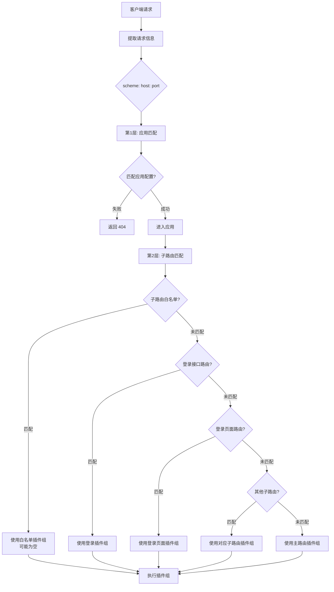
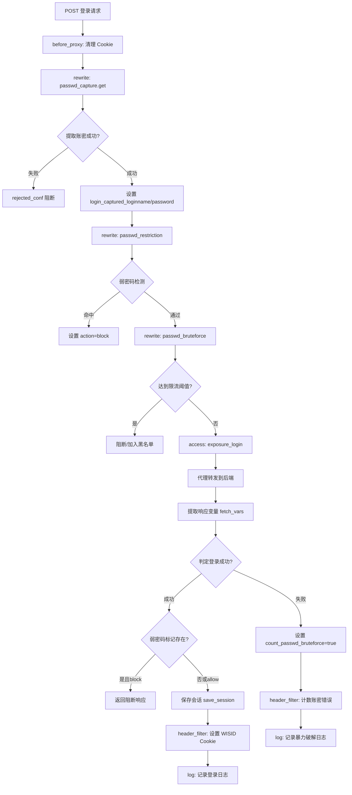
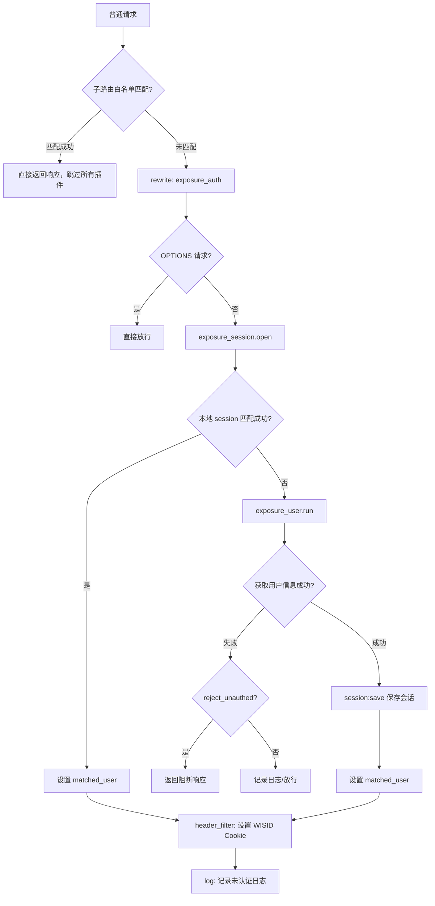
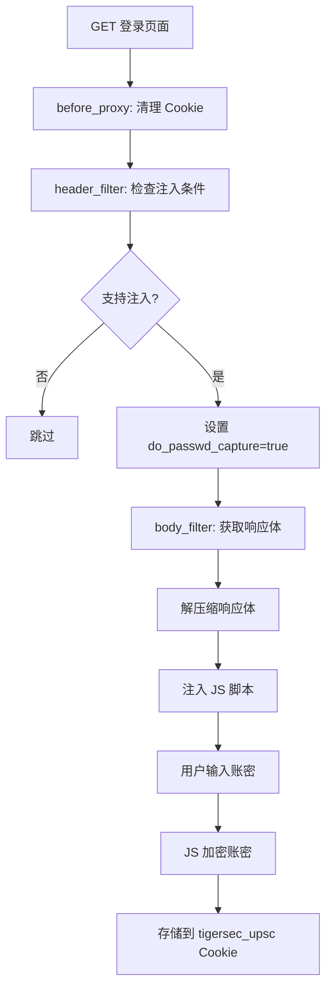
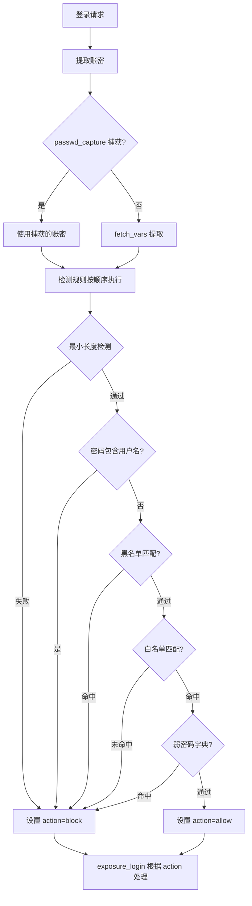
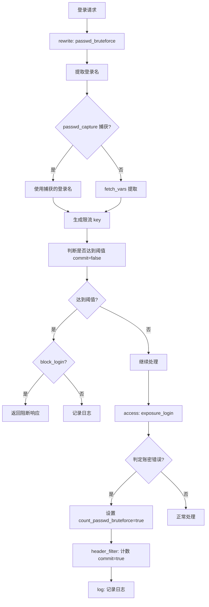
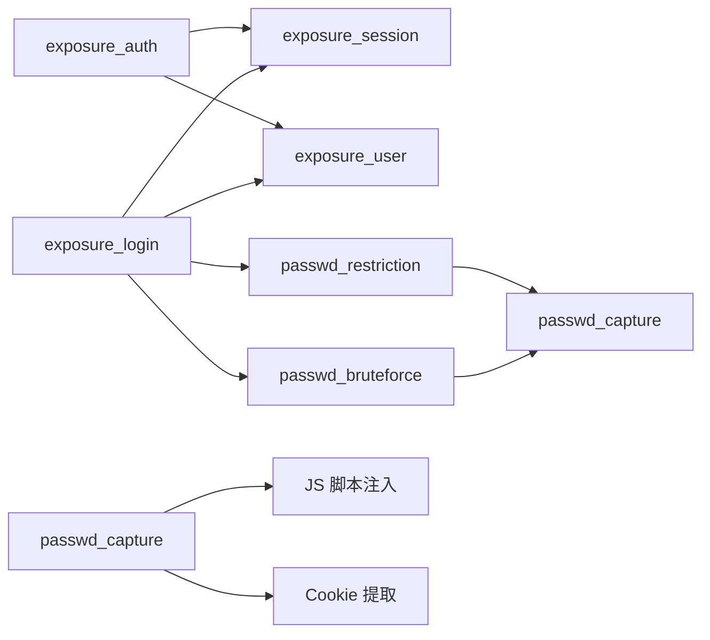

# Shield Plugins 业务流程架构图

## 整体架构

```
┌─────────────────────────────────────────────────────────────────┐
│                        客户端请求                                │
└────────────────────────────┬────────────────────────────────────┘
                             │
                             ▼
┌─────────────────────────────────────────────────────────────────┐
│                    Nginx 网关入口                                │
│  ┌──────────────────────────────────────────────────────────┐   │
│  │  init_worker_by_lua* (初始化阶段)                        │   │
│  │  - exposure_session.init()                               │   │
│  │  - passwd_bruteforce.init()                              │   │
│  └──────────────────────────────────────────────────────────┘   │
└────────────────────────────┬────────────────────────────────────┘
                             │
                             ▼
┌─────────────────────────────────────────────────────────────────┐
│           第1层：应用匹配 (根据访问地址)                         │
│  ┌──────────────────────────────────────────────────────────┐   │
│  │  匹配条件：                                               │   │
│  │  - scheme (http/https)                                   │   │
│  │  - host (域名/IP)                                        │   │
│  │  - port (端口号)                                         │   │
│  │                                                           │   │
│  │  匹配成功 → 进入应用子路由匹配                            │   │
│  │  匹配失败 → 返回 404                                      │   │
│  └──────────────────────────────────────────────────────────┘   │
└────────────────────────────┬────────────────────────────────────┘
                             │
                             ▼
┌─────────────────────────────────────────────────────────────────┐
│           第2层：子路由匹配 (基数树匹配 URI/Method/Vars)        │
│  ┌──────────────────────────────────────────────────────────┐   │
│  │  按优先级顺序匹配：                                       │   │
│  │                                                           │   │
│  │  1. 子路由白名单匹配 (最高优先级)                         │   │
│  │     - 匹配成功 → 使用子路由插件组 (可能为空)             │   │
│  │     - 完全跳过主路由插件组                                │   │
│  │                                                           │   │
│  │  2. 登录接口子路由匹配                                    │   │
│  │     - URI: POST /api/login 等                            │   │
│  │     - 匹配成功 → 使用登录插件组                           │   │
│  │                                                           │   │
│  │  3. 登录页面子路由匹配                                    │   │
│  │     - URI: GET /login 等                                 │   │
│  │     - 匹配成功 → 使用登录页面插件组                       │   │
│  │                                                           │   │
│  │  4. 其他子路由匹配                                        │   │
│  │     - 匹配成功 → 使用对应子路由插件组                     │   │
│  │                                                           │   │
│  │  5. 无匹配 → 使用主路由插件组 (默认)                      │   │
│  └──────────────────────────────────────────────────────────┘   │
└────────────────────────────┬────────────────────────────────────┘
                             │
                             ▼
                ┌────────────┴────────────┬────────────┬────────────┐
                │                         │            │            │
                ▼                         ▼            ▼            ▼
    ┌──────────────────┐      ┌──────────────────┐  ┌──────────────────┐  ┌──────────────────┐
    │   子路由白名单    │      │   登录接口路由    │  │   登录页面路由    │  │   主应用路由      │
    │ (plugins: [])    │      │ (POST /login)    │  │ (GET /login)     │  │  (其他请求)      │
    │ 完全跳过插件     │      │                  │  │                  │  │                  │
    └────────┬─────────┘      └────────┬─────────┘  └────────┬─────────┘  └────────┬─────────┘
             │                         │                     │                     │
             │                         │                     │                     │
             ▼                         ▼                     ▼                     ▼
    ┌──────────────────┐      ┌──────────────────┐  ┌──────────────────┐  ┌──────────────────┐
    │   直接返回响应    │      │   登录插件组      │  │   登录页面插件组  │  │   认证插件组      │
    │  (无需处理)      │      │                  │  │                  │  │                  │
    │                  │      │ - passwd_capture │  │ - passwd_capture │  │ - exposure_auth  │
    │                  │      │   (get)          │  │   (set)          │  │ - proxy_rewrite  │
    │                  │      │ - passwd_        │  │                  │  │ - unzip          │
    │                  │      │   restriction    │  │                  │  │ - response_      │
    │                  │      │ - passwd_        │  │                  │  │   rewrite        │
    │                  │      │   bruteforce     │  │                  │  │ - gzip           │
    │                  │      │ - exposure_login │  │                  │  │ - app_logger     │
    └──────────────────┘      └──────────────────┘  └──────────────────┘  └──────────────────┘
```

## 请求匹配流程详解

### 两层匹配机制



### 应用匹配规则

应用匹配基于以下配置字段：

| 字段 | 说明 | 示例 |
|------|------|------|
| `scheme` | 协议类型 | `http`、`https` |
| `host` | 域名或IP | `example.com`、`192.168.1.1` |
| `port` | 端口号 | `80`、`443`、`8080` |

**匹配逻辑**：
- 请求的 `scheme://host:port` 必须与应用配置完全匹配
- 匹配成功后才能进入子路由匹配阶段
- 匹配失败返回 404 错误

### 子路由匹配规则

子路由匹配基于以下条件（按优先级顺序）：

1. **子路由白名单**（最高优先级）
   - 匹配条件：URI、HTTP Method、vars（可选）
   - 匹配成功：使用子路由插件组（可能为空数组 `[]`）
   - 效果：完全跳过主路由插件组

2. **登录接口路由**
   - 匹配条件：URI（如 `/api/login`）、Method（通常为 `POST`）
   - 匹配成功：使用登录插件组
   - 插件：`passwd_capture`、`passwd_restriction`、`passwd_bruteforce`、`exposure_login`

3. **登录页面路由**
   - 匹配条件：URI（如 `/login`）、Method（通常为 `GET`）
   - 匹配成功：使用登录页面插件组
   - 插件：`passwd_capture`（set模式）

4. **其他子路由**
   - 匹配条件：自定义 URI、Method、vars
   - 匹配成功：使用对应子路由插件组

5. **主路由**（默认）
   - 所有子路由都不匹配时使用
   - 插件：`exposure_auth`、`proxy_rewrite` 等

## 插件执行阶段

### Nginx 请求处理阶段

```
请求处理流程
    │
    ├─ before_proxy 阶段
    │   └─ passwd_capture.before_proxy() - 清理 Cookie
    │
    ├─ rewrite 阶段
    │   ├─ redirect - 请求重定向
    │   ├─ client_ip - 获取客户端 IP
    │   ├─ uri_blocker - URI 拦截（SQL 注入等）
    │   ├─ ua_restriction - UA 限制
    │   ├─ ip_restriction - IP 限制
    │   ├─ passwd_capture (get) - 提取账密
    │   ├─ passwd_restriction - 弱密码检测
    │   ├─ passwd_bruteforce - 暴力破解检测
    │   ├─ exposure_auth - 入口认证
    │   └─ exposure_login - 登录处理
    │
    │   注意：子路由白名单在路由匹配阶段处理（基数树匹配），
    │         匹配成功则跳过所有插件，不会进入 rewrite 阶段
    │
    ├─ access 阶段
    │   └─ exposure_login.access() - 代理转发登录请求
    │
    ├─ header_filter 阶段
    │   ├─ passwd_capture.header_filter() - 设置注入标记
    │   ├─ exposure_session.set_cookie() - 设置 WISID Cookie
    │   └─ passwd_bruteforce.header_filter() - 计数账密错误
    │
    ├─ body_filter 阶段
    │   └─ passwd_capture.body_filter() - 注入 JS 脚本
    │
    └─ log 阶段
        ├─ exposure_auth.log() - 记录未认证日志
        ├─ exposure_login.log() - 记录登录日志
        └─ passwd_bruteforce.log() - 记录暴力破解日志
```

## 核心业务流程

### 1. 登录流程（登录接口）



### 2. 认证流程（普通接口）



### 3. 账密捕获流程（登录页面）



### 4. 弱密码检测流程



### 5. 暴力破解防护流程



## 插件协作关系



## 数据流向

### Session 管理数据流

```
用户请求
    │
    ├─ Cookie/Header (WISID 或应用认证 key)
    │   │
    │   ▼
    │ exposure_session.open()
    │   ├─ 本地缓存查询 (mlcache)
    │   │   ├─ L1: worker 本地 LRU
    │   │   ├─ L2: shared dict
    │   │   └─ L3: http_auth.query() → 虎盾 Portal API
    │   │
    │   └─ 匹配成功 → 返回用户信息
    │
    └─ 无有效会话
        │
        ▼
    exposure_user.run()
        │
        ├─ 子请求到后端应用
        │   └─ 提取用户信息 (user_id, user_name)
        │
        ▼
    exposure_session.save()
        │
        ├─ http_auth.login() → 虎盾 Portal API
        │   └─ 获取 WISID
        │
        └─ 更新本地缓存
            └─ 设置 WISID Cookie
```

### 账密处理数据流

```
登录页面 (GET)
    │
    ▼
passwd_capture.set
    │
    ├─ 注入 JS 脚本
    │   └─ 监听表单提交
    │
    └─ 用户输入账密
        │
        ▼
    JS 加密 (RSA)
        │
        ▼
    存储到 Cookie (tigersec_upsc)
        │
        ▼
登录请求 (POST)
    │
    ▼
passwd_capture.get
    │
    ├─ 提取 Cookie
    │   ├─ Base64 解码
    │   └─ RSA 解密
    │
    └─ 设置到 api_ctx
        ├─ login_captured_loginname
        └─ login_captured_password
            │
            ├─ passwd_restriction 使用
            └─ passwd_bruteforce 使用
```

## 配置层次结构

```
应用配置
    │
    ├─ plugins (主插件组)
    │   ├─ redirect
    │   ├─ client_ip
    │   ├─ uri_blocker
    │   ├─ ua_restriction
    │   ├─ passwd_capture (set)
    │   ├─ exposure_auth
    │   ├─ proxy_rewrite
    │   ├─ unzip
    │   ├─ response_rewrite
    │   ├─ gzip
    │   └─ app_logger
    │
    ├─ sub_routes (子路由)
    │   ├─ 子路由白名单 (优先匹配)
    │   │   ├─ plugins: [] (空插件组，完全跳过)
    │   │   └─ routes: [/health, /metrics, /favicon.ico, ...]
    │   │
    │   ├─ 登录接口路由
    │   │   ├─ uri_blocker
    │   │   ├─ ua_restriction
    │   │   ├─ passwd_capture (get)
    │   │   ├─ passwd_restriction
    │   │   ├─ passwd_bruteforce
    │   │   └─ exposure_login
    │   │
    │   └─ 登录页面路由
    │       ├─ uri_blocker
    │       ├─ ua_restriction
    │       └─ passwd_capture (set)
    │
    └─ plugin_confs (插件配置)
        ├─ exposure_session (全局配置)
        ├─ exposure_user (全局配置)
        └─ 其他插件配置
```

## 关键数据结构

### API 上下文 (api_ctx)

```lua
api_ctx = {
    -- 请求信息
    trace_id = "...",
    client_ip = "...",
    matched_route = {...},
    matched_tenant = {...},

    -- 账密捕获
    login_captured_loginname = "...",
    login_captured_password = "...",

    -- 认证信息
    matched_user = {
        id = "...",
        name = "..."
    },

    -- 插件标记
    count_passwd_bruteforce = true/false,
    log_passwd_restriction = {...},
    log_passwd_bruteforce = {...},
    log_login_request = {...},

    -- Session 对象
    exposure_session = session_obj,

    -- 代理标记
    proxy_passed = true/false,
    do_passwd_capture = true/false
}
```

### Session 对象

```lua
session = {
    conf = {...},
    key = "cookie_WISID",
    values = {...},
    value = "...",
    data = {
        id = "...",
        name = "..."
    },
    real_ip = "...",
    tenant_id = "...",
    route_id = "...",
    user_agent = "..."
}
```

## 缓存架构

```
Session 缓存 (mlcache)
    │
    ├─ L1: Worker 本地 LRU 缓存
    │   └─ 最快访问，worker 内共享
    │
    ├─ L2: Shared Dict 缓存
    │   └─ 跨 worker 共享，内存存储
    │
    └─ L3: 虎盾 Portal API
        └─ 最终数据源，HTTP 请求
```

## 安全防护层次

```
┌─────────────────────────────────────┐
│  第1层: 基础防护                     │
│  - uri_blocker (SQL注入等)          │
│  - ua_restriction (UA限制)          │
│  - ip_restriction (IP限制)          │
└─────────────────────────────────────┘
             │
             ▼
┌─────────────────────────────────────┐
│  第2层: 账密安全                     │
│  - passwd_capture (账密捕获)        │
│  - passwd_restriction (弱密码检测)  │
│  - passwd_bruteforce (暴力破解)     │
└─────────────────────────────────────┘
             │
             ▼
┌─────────────────────────────────────┐
│  第3层: 身份认证                     │
│  - exposure_auth (入口认证)         │
│  - exposure_session (会话管理)      │
│  - exposure_user (用户信息获取)     │
└─────────────────────────────────────┘
```

## 日志记录点

```
日志记录时机
    │
    ├─ 未认证请求 (exposure_auth)
    │   └─ log_unauthed = true
    │
    ├─ 登录请求 (exposure_login)
    │   └─ log_request = true
    │
    ├─ 弱密码检测 (passwd_restriction)
    │   └─ 登录成功且检测到弱密码
    │
    └─ 暴力破解 (passwd_bruteforce)
        └─ 达到限流阈值
```

## 外部依赖

```
┌─────────────────────────────────────┐
│  虎盾 Portal                        │
│  - /api/sdk/login (获取 WISID)      │
│  - /api/user/info (查询用户信息)    │
└─────────────────────────────────────┘
             ▲
             │
    ┌────────┴────────┐
    │                 │
    ▼                 ▼
http_auth.login  http_auth.query
    │                 │
    └────────┬────────┘
             │
             ▼
    exposure_session
```
