本文用于指导快速完成泛微 v10 的互联网暴露面收敛接入流程。

## 第一步：注册 WEB 隐身盾账号
进入 WEB隐身盾盾官网 https://www.id-net.cn 了解大概功能，
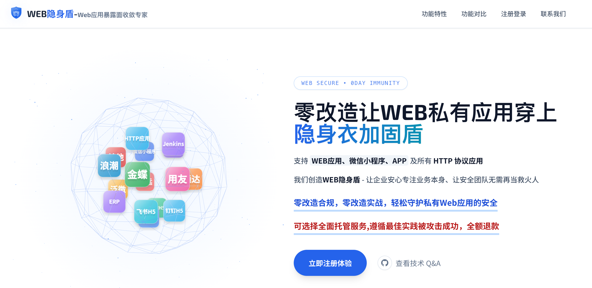

进入 控制台注册页面 https://console.id-net.cn/register ，完成账号自助注册（内测阶段需要邀请码）并登录。
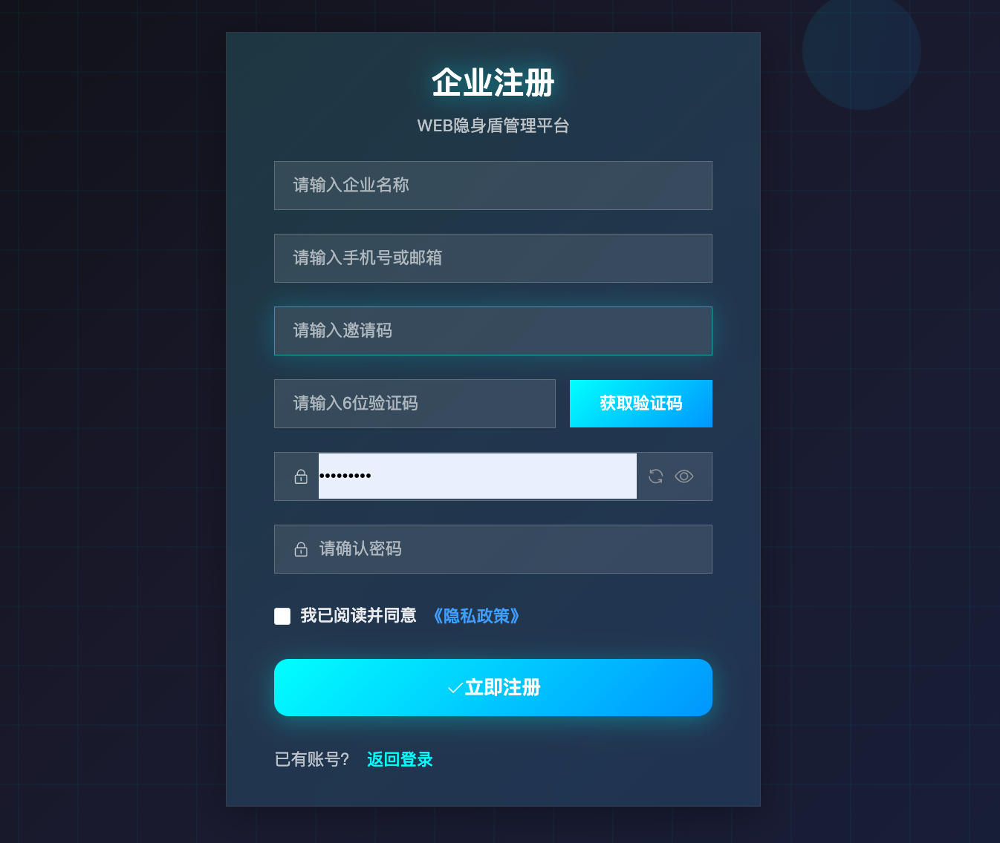

## 第二步：完成域名认证
在控制台进入“域名认证/域名管理”，新增需要保护的域名。
按照提示完成 DNS 解析和校验，等待认证通过。
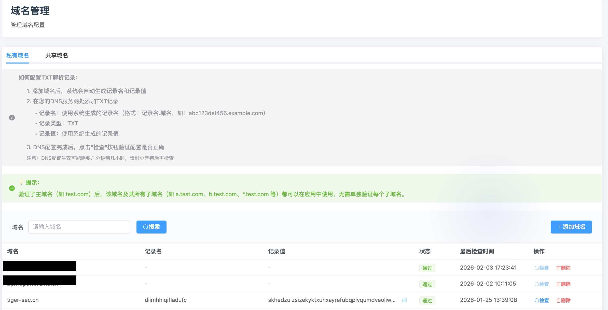

## 第三步：创建泛微应用并选择泛微插件
在控制台“应用管理”中新建应用类型选择“泛微”。
假如是泛微V10，在插件/规则选择中勾选“泛微插件（v10）”，
假如是泛微V9，在插件/规则选择中勾选“泛微插件（v9）”，(泛微V9不能使用共享云网关，必须使用私有网关，需要开更多的端口)
选择接入的网关 beijing.id-net.cn(59.110.62.75)
保存应用配置。
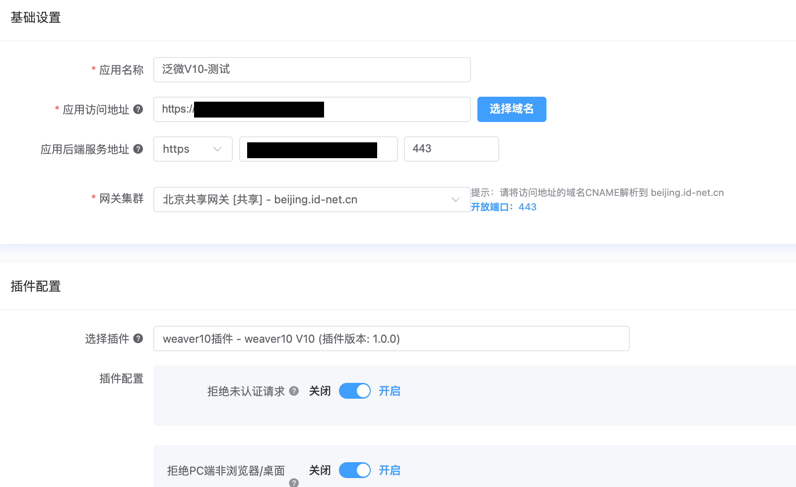

## 第四步：修改本地 hosts 进行验证
在测试客户端的 hosts 文件中，将业务域名解析到隐身盾接入地址。
59.110.62.75 demowork.xxx.com.cn

注意： 59.110.62.75为刚才接入网关的IP地址

访问业务系统，确认功能可用、页面正常加载。
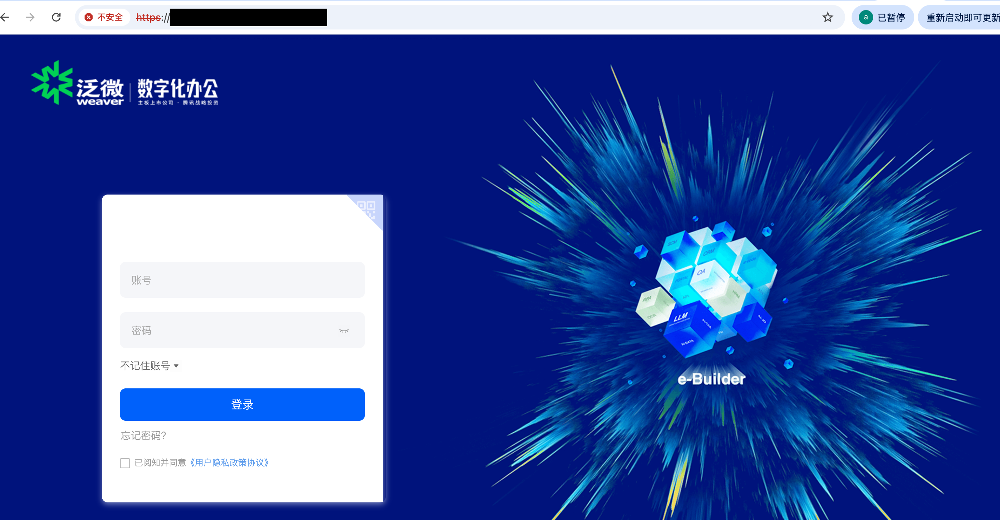
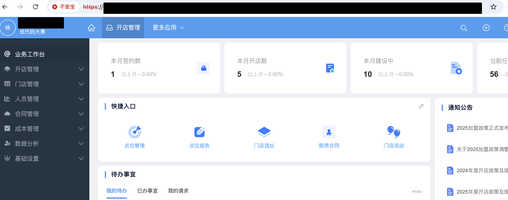
一切正常。

## 第五步：攻击测试
### 访问非登录口 
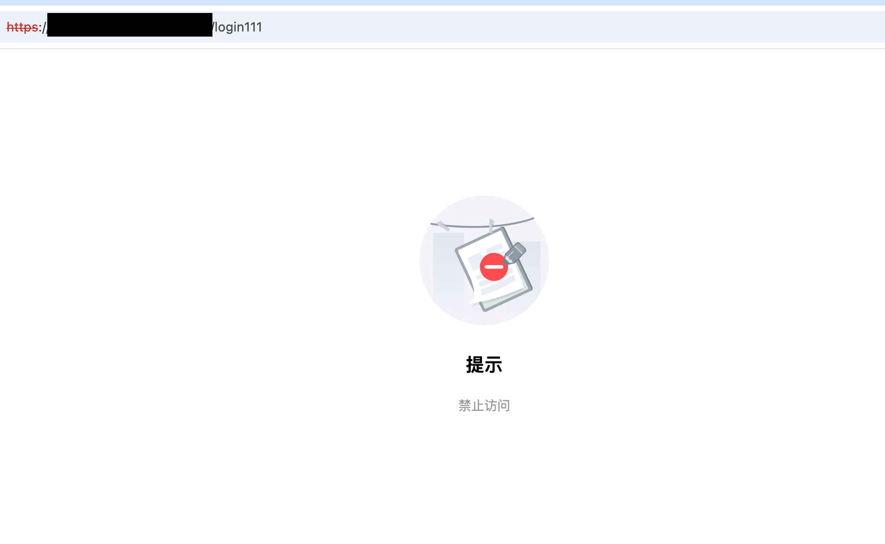

### xpoc攻击
命令行发起攻击
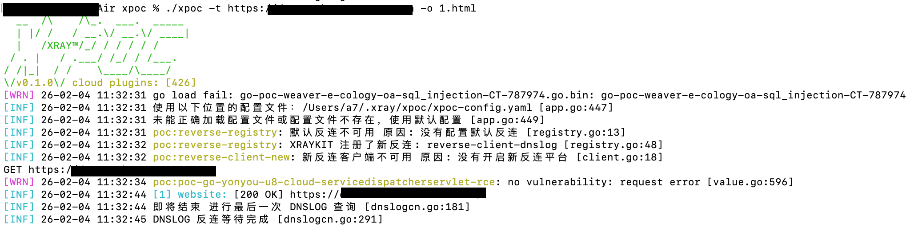

哇，攻击全部拦截了
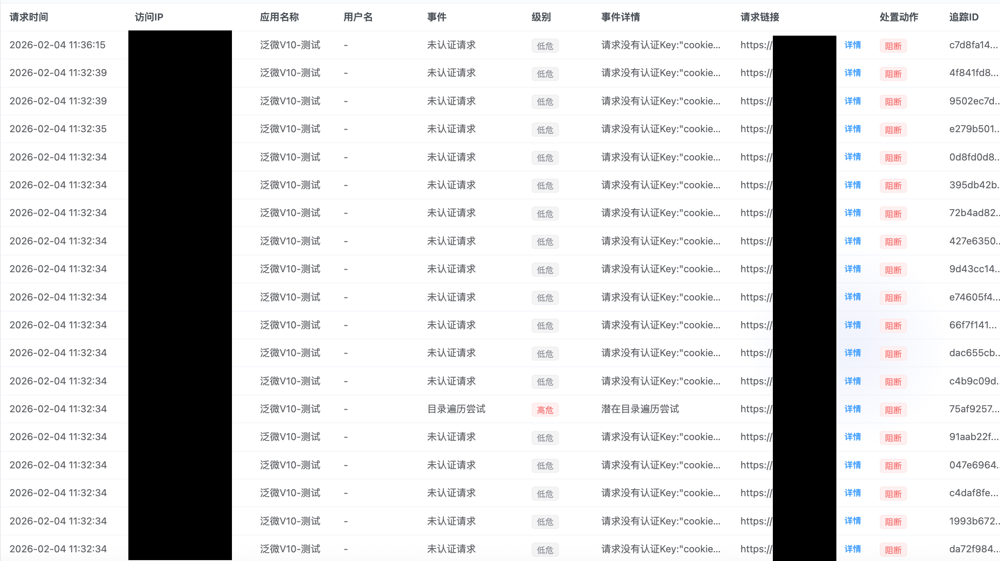

账号密码暴力破解攻击
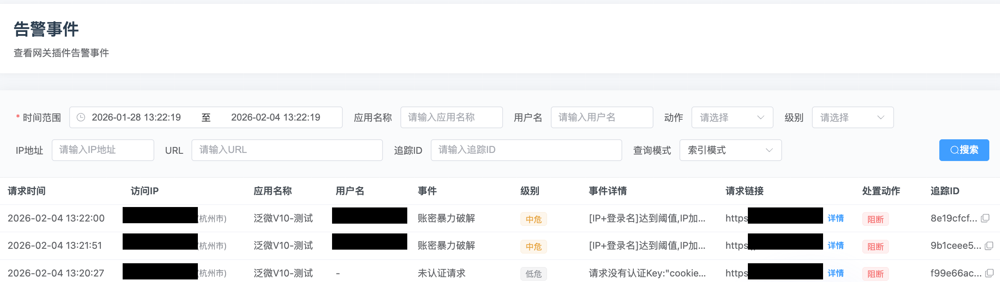
尝试多次后冻结IP地址

## 第六步：切换域名并灰度测试模式
把 demowork.xxx.com.cn 使用cname 指向 beijing.id-net.cn

在应用设置中开启“灰度测试模式”，先对某几个省进行灰度。并且切换域名。
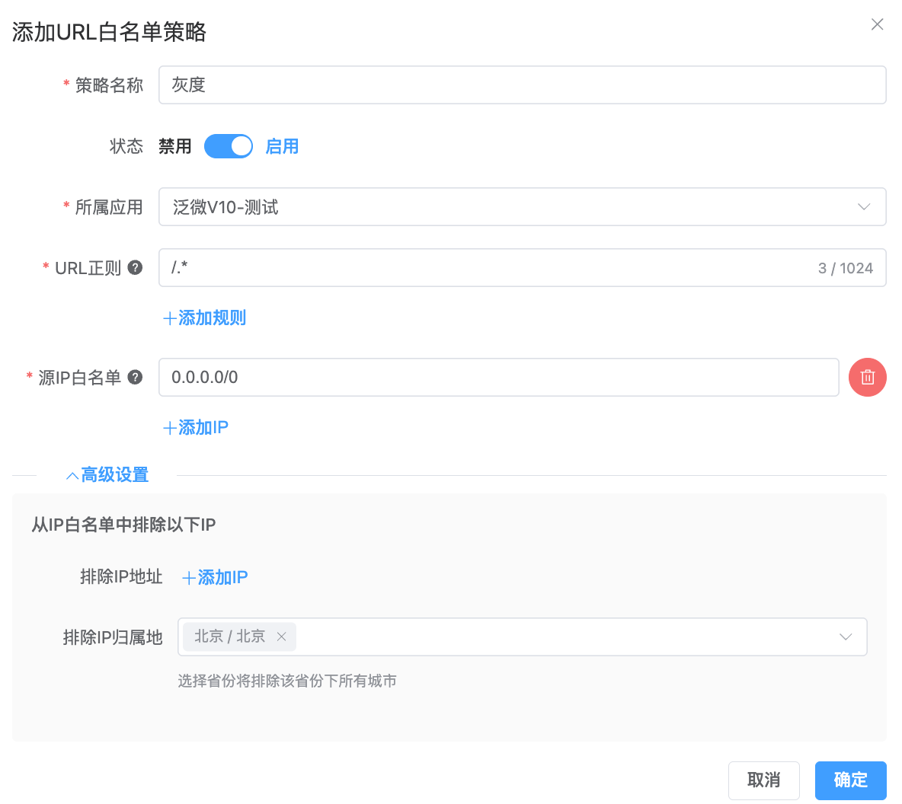

验证通过后，就可以逐步放量。

至此，无需修改应用代码，泛微互联网暴露面就收敛了，就这么简单。

